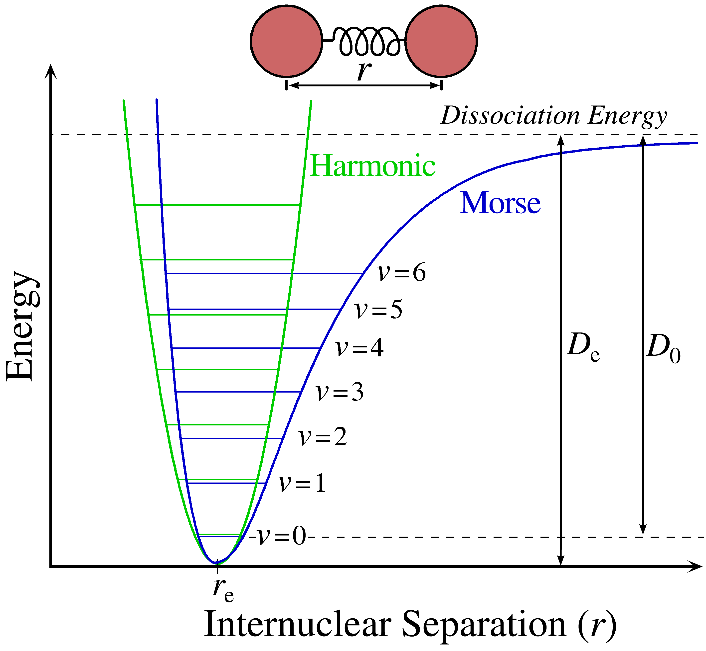
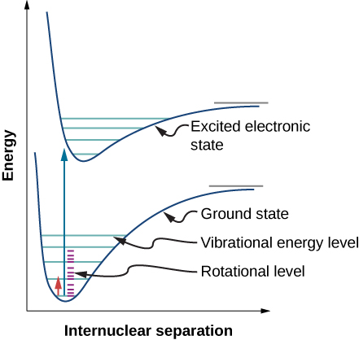



# Chemical Structure and Bonding (111/113)  

# Chemical Dynamics (112/114)

## <ins> Boltzmann Distribution </ins>
Boltzmann Law

 $$\frac{n_j}{n_i} = e^{-\frac{(\epsilon _j-\epsilon _i)}{kT}}$$

where $$k=1.38 × 10^{-23} \frac{j}{k}$, and $j\neq i$$

The most probable distribution will have more particles at the
lowest level then at any other level.

Effects of Temperature:
  - At high temperature there are more excited states
  - At low temperature more particles are at ground state

## <ins> Energy Levels (electronic, vibrational, rotational, translational) <ins>
Electronic energy:
  - Largest Energy.
  - All molecular phases experience this type of energy.

Vibrational Energy:
  - Vibrating molecules are treated as harmonic oscillators (springs)

bond stretching, bending, etc.

Two forces: Force Constant ($$k_f$$) and Reduced Mass ($$\mu$$)

$$\epsilon_{vib} = \Bigl(i+\frac{1}{2}\Bigl)^2 \Bigl(\frac{h^2}{4π^2}\Bigl)\Bigl(\frac{1}{\mu d^2}\Bigl)$$
where $$d$$ = displacement: (length of vibration) and $$i = 0, 1, 2,\ldots$$

  

Rotational Energy:
  - Molecules can rotate (rigid rotor).
  - Generally, only gases and some liquids can rotate.

$$\epsilon_{rot} = i(i+1)\Bigl(\frac{h^2}{8π^2}\Bigl)\Bigl(\frac{1}{\mu R^2}\Bigl)$$

where $$i = 0, 1, 2,\ldots$$, $$R = $$ bond length in meters, and $$\mu = $$ reduced mass

Translational energy:

$$\epsilon _{n_x,n_y,n_z} = \epsilon _{trans} = (n_x^2 + n_y^2 + n_z^2)\Bigl(\frac{h^2}{8}\Bigl)\Bigl(\frac{1}{md^2}\Bigl)$$

$$R$$ = bond length in meters

  - Molecules are spaced extremely close together.
  - No force constant in translation energy equations.
  - Molecules are typically in the gas phase  

$$m =$$ normal mass in kg (NOT REDUCED MASS), Ground state = $$111$$, First excited state = $$211$$

Multiple energies in one diagram

  

## <ins> Gas Laws <ins>
Kinetic Theory of Gases

Ideal Gas Equation of State

Van der Waals Equation

Redlich-Kwong Equation

#### Ideal Gas Law
$$PV = nRT$$
The ideal gas law combine elements of the simple gas laws (Include simple gas laws) to represent the relationship between pressure, volume and temperature of a molecule in the gas phase.
  - P = Pressure (atm)
  - V = Volume (L)
  - n = Moles (mols)
  - R = Gas Constant = 0.082057 ($$(L atm)/(mol K)$$)

## <ins> Internal Energy ins>
Internal energy is the sum of all the energy of all the particles in the system.
Internal energy is denoted with the symbol $$U$$.
When we are referring to internal energy it is important to note that we are alluding to a state function.
State functions or state variables are properties of a system that are determined by the current state of the system rather than the path which the system that got to that state (conveniently these are called path functions).
We can see changes in the internal energy of a system in a couple of ways:
the first (and one that we tend to not think about a lot and ignore) is by changing the number of particles within a system.
The second and third are much more important and are heat ($$q%$) and work ($$w$$).
Thus we can think about a change in internal energy as the sum of the heat added to and work applied to the system.
While internal energy is a state function,
heat and work are both path dependent.
We will discuss work more thoroughly in another section of this website.
## <ins> Enthalpy <ins>
For a process where pressure volume work is the only work done on the system the first law of thermodynamics is that change in internal energy is equal to $q+w$ or $q$ minus the integral of $$PdV$$ from $$V_1$$ to $$V_2$$.
Therefore, if we are at a constant volume our change in internal energy is just equal to $$q_v$$ (subscript the $$v$$ to indicate volume).
We can also do processes at constant pressure whereby change in $$U$$ is equal to $$q_p$$ (subscript the p to indicate pressure) $$- P\Delta V$$ which can be arranged to equal $$q_p = \Delta U + P\Delta V$$.
If we define a new state function,
Enthalpy ($$H$$), as
$$H = U + PV$$
we can see that (by the chain rule in calculus)

$$\Delta H = \Delta U + \Delta (PV) = \Delta U + P \Delta V + V \Delta P $$

where at constant pressure

$$\Delta H = \Delta U + P \Delta V $$

We can see then that $$\Delta H$$ is equal to $$q_p$$.
Therefore at a constant pressure $$H$$
virtually works the same as $$U$$ when there is constant volume.
## <ins> Entropy <ins>
From the first law of thermodynamics we can come up with the idea that energy is conserved and thus the change of energy in the universe (universe being a little abstract in that it is both our system and the surroundings) must be equal to $$0$$. If the change in energy is always equal to $$0$$ how does anything actually occur? For systems that release energy to the surroundings the explanation is relatively intuitive but for systems which absorb energy (moving to higher energy levels) there needs to be some way to explain why this occurs. This is the idea of entropy ($$S$$), a state function (we will discuss more this semester as to what entropy actually is). The second law of thermodynamics states that the change in entropy of the universe is equal to the change of entropy of the system and the change in entropy of the surroundings. This change in entropy of the universe must be greater than $$0$$.

One way to think about entropy is through a probability lens. Entropy can be related to the Boltzmann constant where $$S = kln(W)$$ where W is equal to $$\frac{n!}{n_0!n_1!n_2!\ldots n_j!}$$. Where n is the number of particles in the system. From this definition we can see that entropy will increase when the number of particles in a system increases. If we refer back to the Boltzmann distribution section we can also see that the entropy of the system will increase as the temperature increases.

## <ins> Gibbs Free Energy <ins>

Gibbs energy determines the spontaneous direction for a process at constant temperature and pressure and is thermodynamic state function defined by:
$$G = U - TS + PV$$ (fix up) or $$G = H - TS$$.

## <ins> Thermodynamic Laws <ins>
#### First Law
$$\Delta U = q + w$$
Change in internal Energy is the heat plus work applied

$$\Delta U$$ is a state function
$$q + w$$ are not state functions

Work = (force applied) x (distance travelled)

 or 

$$w = -P\Delta V = -nR\Delta T$$

#### Hess's Law
Change in state from $$A$$ to $$B$$ involves more than one step, then the overall change in a state function would be the sum of the changes.
Bond dissociation energy (BDE)
It takes energy to break bonds
$$\Delta _r U = \sum BDE_{reactants} - \sum BDE_{products}$$

Stronger bond energy is correlated with a lower ground state
#### Second Law  
The second law is:
$\Delta S_{universe} = \Delta S_{sys} + \Delta S_{surr} > 0$
## <ins> Heat Capacity <ins>

## <ins> Equilibria <ins>
## <ins> Phase Diagrams <ins>

A phase diagram is a plot that shows gas curves, liquid curves, and solid curves relative to pressure and temperature.
(insert picture of this)

We can divide the phase diagram into three different regions or phases: gas, liquid, and solid.
These regions are defined as the region where each phase has the lowest Gibbs Free Energy (most favorable) relative to the other phases and thus will be the only phase present.
These regions are separated with boundary lines. Along these boundary lines the phases are in equilibrium and the $\Delta G$ is equal to $0$.

Additionally, from this phase diagram we should be able to relatively easily
 identify the following temperatures and pressures:
Standard Melting/Freezing Point:
Melting point at standard pressure (go from solid to a liquid)
Standard Boiling/Condensation Point:
Boiling point at standard pressure (go from liquid to a gas)
Triple Point:
All three phases coexist in equilibrium. Here is a cool video of the triple point of water:
Critical Point:
End of the delineation of the liquid-gas boundary.
At this point there becomes no effective distinction between the liquid and gas phases can be made.
Instead we get what is called a supercritical fluid which has both gas and liquid like properties.
Critical opalescence is an interesting phenomenon that occurs and leads to interesting light scattering.
Here is a cool video of critical opalescence: (find video)

## <ins> Kinetics <ins>

## <ins> Endo- vs Exo-thermic Processes <ins>
## <ins> Work and Force <ins>

# Organic Chemistry

# Additional Outside Resources:
