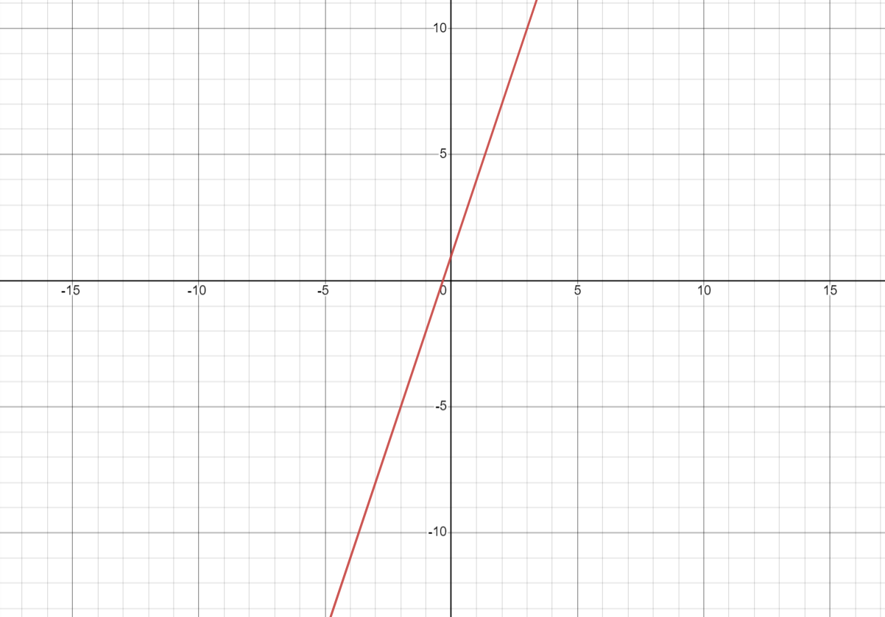
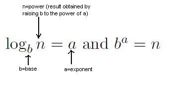
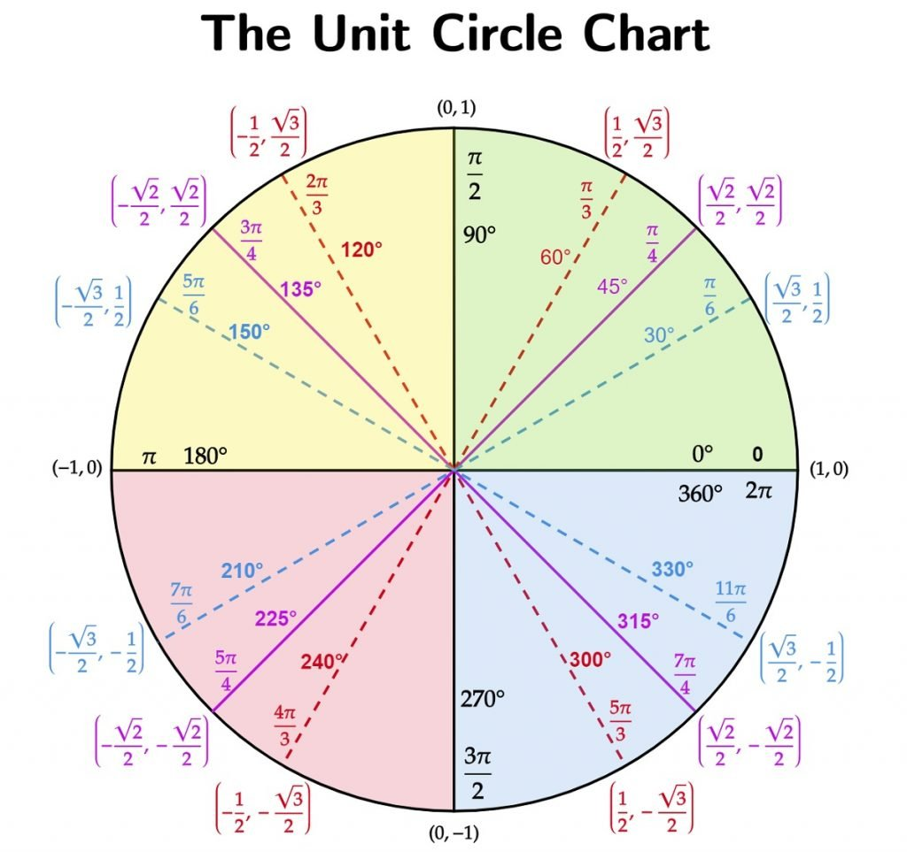

--- 
title: Math Review
permalink: /math/
usemathjax: true
---



## Calculus
<ins>Limits:</ins>

A limit is one of the most important parts of calculus. The idea of a limit sets the foundation of everything in calculus such that every formal definition of a derivative and an integral is defined through a limit. So! What is a limit? A limit looks like this:
$$\lim_{x \to 0} (3x+1)$$
where this function looks like this:

  

and what our limit is asking is this: as $x$ approaches $0$, what does the function $3x+1$ equal? Basically, if I zoomed in on this graph at $0$, what does the function equal? In this case:

$$\lim_{x \to 0} (3x+1)=1$$

This is the simple idea of a limit, and we use this definition to define the rest of calculus. 

  2. Diffentiation
      - What are derivatives?
        - A derivative is the instantuous rate of change (can be visualized by the line tangent to the graph at a particular point) of a given function. For example: $$\frac{d}{dx}(2x)=2$$ is the derivative of 2x with respect to x, and the answer 2 is the slope/rate of change of 2x at all points on the function. 
        - The formal definition of a derivative is provided through this formula: $$f'(x)=\lim_{\Delta x \to 0} \frac{f(x+\Delta x)-f(x)}{\Delta x}$$
      - First Derivatives 
      [//]: # "I think this is a bad thing to summarize because there is context that needs to be given"
      - Second Derivatives and Beyond 
      [//]: # "I think this is a bad thing to summarize because there is context that needs to be given"
      - Critical Points
      - Inexact and Exact Differentials
        - Exact differential follows the Fundamental Theorem of Calculus s.t. 
	$\frac{\partial f(x)}{\partial x} = f'(x)$
  3. Summation
  4. Integration
      - Fundamental Theorem of Calculus
      - Integral Table
      - Polar Coordinates
      - Multiple Integration

## Trigonometry
  1. Logarithms
      - Logarithmic Formatting
           - $(\log_b n = a \textrm{ and } b^a = n)$
           - 
      - Natural Logarithms
      - Manipulation
      - Stirlings Approximation
  2. Trigonometry Functions and Identities
  3. Unit Circle
      - 
  4. Series and Series Expansions

## Algebra
  1. Multiplying One by One
  2. FOIL
  3. Deriving Equations
  4. Solving a System of Equations

## Linear Algebra
  1. Eigen Functions
      - Eigen Function:
      - Eigen Value:
      - Eigen Vector:
  2. Dot Product
  3. Orthogonality
  4. Determinants

## Statistics
  1. Normalization
  2. Expectation Values
  3. Standard Deviation
  4. Variance
  5. Mean, median, mode, etc.
  6. Probability
  7. Factorials

## Additional Resources
