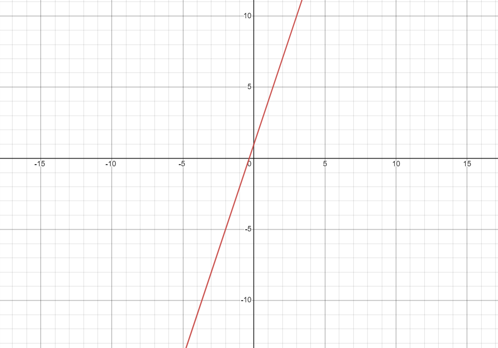
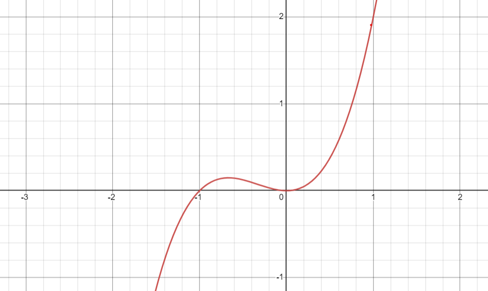

--- 
title: Math Review
permalink: /math/
usemathjax: true
---



# Calculus
### <ins>Limits:</ins>

A limit is one of the most important parts of calculus. The idea of a limit sets the foundation 
of everything in calculus such that every formal definition of a derivative and an integral is defined 
through a limit. So! What is a limit? A limit looks like this:
$$\lim_{x \to 0} (3x+1)$$
where the function $3x+1$ looks like this:

  

and what our limit is asking is this: as $x$ approaches $0$, what does the function $3x+1$ equal? 
Basically, if I zoomed in on this graph at $0$, what does the function equal? In this case:

$$\lim_{x \to 0} (3x+1)=1$$

This is the simple idea of a limit, and we use this definition to define the rest of calculus. 

### <ins>Diffentiation/Derivative:</ins>

A derivative is the instantaneous rate of change (can be visualized by the line tangent to the graph 
at a particular point) of a given function. Another way to think about it, the derivative is the **SLOPE** of the graph! For example: 
$$\frac{d}{dx}(2x)=2$$ 
is the derivative of $2x$ with respect to $x$, and the answer $2$ is the slope/rate of change of $2x$ at all points 
on the function. This makes sense since the function $y=mx$ states that $m$ is the slope of the function $y$. 
Therefore, the slope/derivative of $y=2x$ is $2$. This understanding of a derivative generalizes to all functions! A function's instantaneous rate of change at any point can be calculated through its derivative. Here are some 
differentation techniques that you will need to know:
  
1. Power Rule:

$$\frac{d}{dx}(x^n)=nx^{n-1}$$

2. Product Rule:

$$\frac{d}{dx}\Bigl(f(x)g(x)\Bigl)=f'(x)g(x)+f(x)g'(x)$$

3. Quotient Rule:

$$\frac{d}{dx}\left(\frac{f(x)}{g(x)}\right)=\frac{g(x)f'(x)-g'(x)f(x)}{(g(x))^2}$$

4. Chain Rule (derivative of the inside multiplied by the derivative of the outside):

$$\frac{d}{dx}\Bigl[f(g(x))\Bigl]=f'(g(x))g'(x)$$

Common notation types for derivatives which are all equivalent, let $y=f(x)$:

$$\frac{dy}{dx}=\frac{d}{dx}(y)=\frac{df}{dx}=\frac{df(x)}{dx}=\frac{d}{dx}(f(x))$$

Below information probably not needed

~~The formal definition of a derivative is defined from this limit definition:~~ 

$$\xcancel{\lim_{\Delta x \to 0} \frac{f(x+\Delta x)-f(x)}{\Delta x}=f'(x)}$$

~~What is this limit definition saying?~~

### <ins>Derivative Analysis:</ins>
With derivatives, we can figure out a lot of interesting information about any particular function. Two important
things we can learn about any function can be derived through its first and second derivatives. Take this function: 

$$f(x)=x^3+x^2$$

And when graphed, looks like this:

  

  

When you take the derivative of this function, what does the answer tell you? Well, we know that the first derivative 
tells us the slope of our graph. For example:

$$f(x)=x^3+x^2\rightarrow f'(x)=3x^2+2x$$

tells us that the slope of $f(x)$ is $3x^2+2x$ for all $x$. How about if we take the derivative again? Then, we have

$$f'(x)=3x^2+2x\rightarrow f''(x)=6x+2$$

which tells us that the slope $f'(x)$ is $6x+2$ for all $x$. There are many different interesting things that we can learn 
about $f(x)$ given $f'(x)$ and $f''(x)$. Here are the various things you can learn from these new derivative functions:
- Second Derivatives and Beyond 
- Critical Points
- Inexact and Exact Differentials
  - Exact differential follows the Fundamental Theorem of Calculus s.t. 
$\frac{\partial f(x)}{\partial x} = f'(x)$
3. Summation
4. Integration
    - Fundamental Theorem of Calculus
    - Integral Table
    - Polar Coordinates
    - Multiple Integration

## Trigonometry
  1. Logarithms
      - Logarithmic Formatting
           - $(\log_b n = a \textrm{ and } b^a = n)$
           - 
      - Natural Logarithms
      - Manipulation
      - Stirlings Approximation
  2. Trigonometry Functions and Identities
  3. Unit Circle
      - 
  4. Series and Series Expansions

## Algebra
  1. Multiplying One by One
$$\frac{2+2}{4}$$
  3. FOIL
	$$(a+b)(c+d)$$
  4. Deriving Equations
  5. Solving a System of Equations

## Linear Algebra
  1. Eigen Functions
      - Eigen Function:
      - Eigen Value:
      - Eigen Vector:
  2. Dot Product
  3. Orthogonality
  4. Determinants

## Statistics
  1. Normalization
  2. Expectation Values
  3. Standard Deviation
  4. Variance
  5. Mean, median, mode, etc.
  6. Probability
  7. Factorials

## Additional Resources
