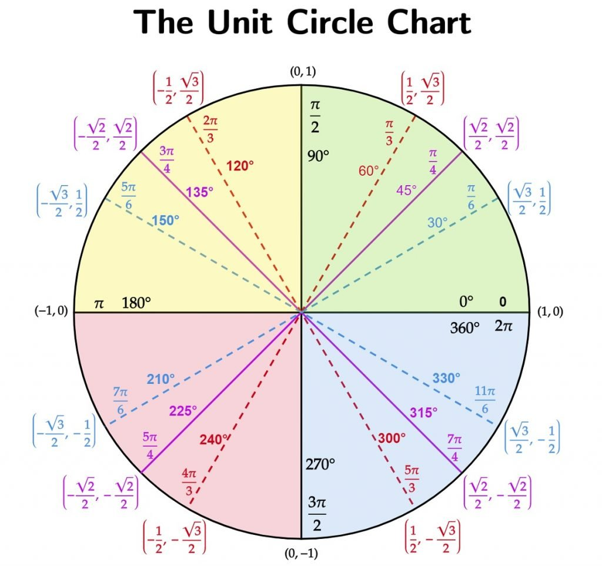

___
title: Math Intro/Review
permalink: /math/
use_math: true
___

Can you use latex?

$$-\frac{\partial V(r)}{r}$$

# Mathematics Concepts

## Calculus
  1. Derivation
      - What are derivatives?
      - First Derivatives
      - Second Derivatives and Beyond
      - Critical Points
      - Inexact and Exact Differentials
  2. Integration
      - Fundamental Theorem of Calculus
      - Integral Table
      - Polar Coordinates
      - Multiple Integration
  3. Summation

## Trigonometry
  1. Logarithms
      - Natural Logarithms
      - Manipulation
      - Stirlings Approximation
  2. Trigonometry Functions and Identities
  3. Unit Circle
      - 
  4. Series and Series Expansions

## Algebra
  1. Multiplying One by One
  2. FOIL
  3. Deriving Equations

## Linear Algebra
  1. Eigen Functions
      - Eigen Function:
      - Eigen Value:
      - Eigen Vector:
  2. Dot Product
  3. Orthogonality
  4. Determinants

## Statistics
  1. Normalization
  2. Expectation Values
  3. Standard Deviation
  4. Variance
  5. Mean, median, mode, etc.
  6. Probability
  7. Factorials

## Additional Resources
=======
>>>>>>> 70afbf6884aba01b06029da4bcf92ed3d36d69c3
